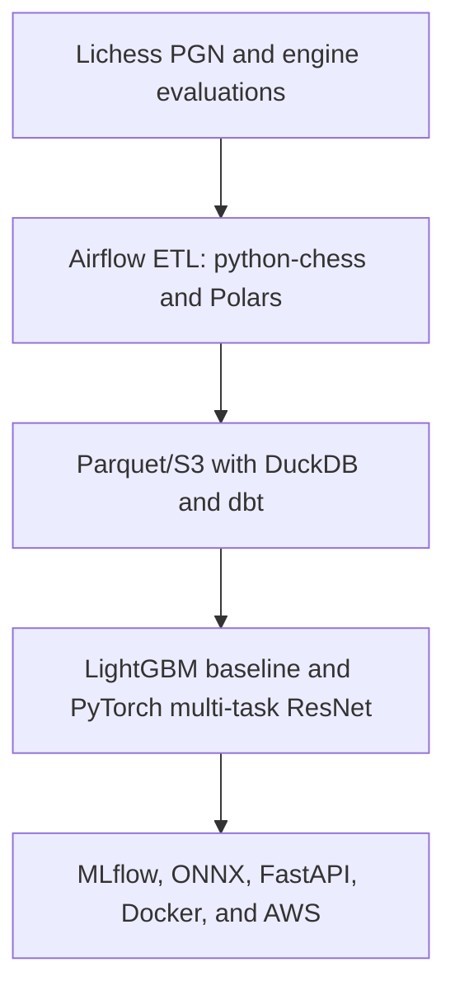

# ChessLens Project Blueprint

> Internal planning and handoff document for a new Work Chat.  
> Project type: large-scale data science, deep learning, ranking, and MLOps portfolio project.  
> Primary target roles: Data Scientist, Applied ML, Machine Learning Engineer, and AI Implementation Engineer.

## 1. Executive Decision

The project will be **ChessLens: A Large-Scale Neural Chess Move-Ranking and Blunder-Risk System**.

ChessLens will ingest and transform large Lichess game archives, train both a classical machine-learning baseline and a custom multi-task neural network, evaluate the models with leakage-aware ranking and calibration metrics, and deploy the selected model as a typed production API.

The final user experience will allow a player to upload a PGN and receive:

- ranked legal moves for important positions;
- win/draw/loss estimates;
- calibrated blunder-risk scores;
- identification of the positions most worth reviewing;
- model version, confidence, and basic explanation information.

This is **not** intended to become a full chess engine or to outperform Stockfish. Stockfish and the Lichess evaluation database provide teacher labels. The project's value is the reproducible data pipeline, supervised neural-network training, ranking evaluation, production deployment, and model analysis.

## 2. Why This Project Is the Right Next Step

### Existing evidence on the current resume

The current resume already demonstrates:

- Python, pandas, NumPy, scikit-learn, and PyTorch;
- pretrained embeddings and semantic/cross-modal retrieval;
- FAISS, FastAPI, Streamlit, Docker, Linux, Git, and pytest;
- AWS S3/Textract and API-based data pipelines;
- JSON Schema validation and extensive automated tests;
- quantitative analysis of 100,000+ records;
- communication with technical and non-technical stakeholders.

### Skills that remain weak or unsupported by project evidence

ChessLens must add credible evidence for:

1. Training a custom supervised deep neural network end to end.
2. Working with 10M+ records/games through a reproducible ETL pipeline.
3. SQL transformations, analytical data modeling, and warehouse-style tests.
4. Ranking/recommendation objectives and metrics.
5. Temporal and user-aware holdouts, leakage audits, calibration, ablations, and error analysis.
6. Experiment tracking, hyperparameter optimization, and model selection.
7. Model export, latency benchmarking, and production inference.
8. CI/CD, cloud deployment, logs, metrics, and drift monitoring.

The project should deepen these areas rather than repeat another small Streamlit or embedding-search demo.

## 3. System Architecture



### End-to-end flow

1. Download monthly Lichess `.pgn.zst` archives and engine-evaluation `.jsonl.zst` data.
2. Stream and parse games without loading the complete source file into memory.
3. Normalize positions, validate fields, and write partitioned Parquet datasets.
4. Create SQL/dbt models for games, positions, moves, labels, and training examples.
5. Train a LightGBM baseline and a multi-task PyTorch residual network.
6. Compare models using fixed splits, ranking metrics, calibration, confidence intervals, and ablations.
7. Register the chosen model and export it to ONNX.
8. Serve inference through FastAPI in Docker and deploy the container to AWS.
9. Monitor latency, errors, input distributions, and model versions.

## 4. Data Sources and Scale

### Primary sources

- [Lichess Open Database](https://database.lichess.org/)
- Standard chess games in monthly PGN archives
- Lichess Stockfish evaluation database
- Optional Lichess puzzle dataset for later error-analysis or training-position extensions

Lichess publishes its database exports under CC0. As of September 10, 2026, one recent standard-game archive is approximately 30 GB and contains roughly 90 million games. The engine-evaluation database contains more than 400 million Stockfish-evaluated positions.

### Scale targets

| Purpose | Target |
| --- | ---: |
| ETL and performance benchmark | At least 10 million complete games |
| Initial local smoke test | 50,000-100,000 positions |
| Baseline training | 1-5 million positions, depending on memory |
| Neural-network training | Start at 1 million positions and scale upward |
| Engine-supervised subset | Approximately 500,000-1 million matched positions |

The pipeline must make sample size configurable. CPU-only smoke tests must work on a laptop, while the same code must scale to a GPU training environment.

### Position identity

- Parse PGN with `python-chess`.
- Normalize FEN to the first four fields when matching the Lichess evaluation database.
- Store a stable hash of the normalized FEN as `position_id`.
- Hash or remove public player identifiers before publishing derived datasets.
- Prevent the same normalized position from appearing across incompatible evaluation partitions when testing generalization.

## 5. Fixed Technology Stack

The following stack is the project default. A new tool should be added only when it solves a concrete problem that the current stack cannot solve.

| Layer | Required tools | Responsibility | Evidence created |
| --- | --- | --- | --- |
| Environment | Python, `uv`, Makefile | Reproducible environment and common commands | Packaging and developer workflow |
| Parsing | `python-chess`, `zstandard` | Stream compressed PGN and construct board states | Domain data ingestion |
| Data processing | Polars, PyArrow | Lazy/streaming transformations and Parquet output | Larger-than-memory processing |
| Analytical storage | Parquet, DuckDB | Local analytical queries and feature extraction | Substantive SQL evidence |
| Data modeling | dbt | Modular SQL models, tests, lineage, and documentation | Warehouse-style transformations |
| Orchestration | Apache Airflow with LocalExecutor | Scheduled and retryable batch DAGs | Workflow orchestration |
| Baseline modeling | LightGBM, scikit-learn | Strong tabular baseline and calibration | Correct comparative modeling |
| Deep learning | PyTorch | Multi-task residual neural network | Custom supervised neural-network training |
| Optimization | Optuna | Hyperparameter search and pruning | Systematic model tuning |
| Experiment tracking | MLflow | Parameters, metrics, artifacts, checkpoints, and model registry | Reproducible experiments |
| Inference | ONNX and ONNX Runtime | Model export, optimization, and latency comparison | Production model optimization |
| API | FastAPI, Pydantic, OpenAPI | Typed and documented inference service | Production model serving |
| Testing and quality | pytest, Hypothesis, mypy, Ruff, pre-commit | Unit, property, integration, typing, and lint checks | Software-engineering rigor |
| Containers and CI/CD | Docker, Docker Compose, GitHub Actions | Tests, builds, images, and automated deployment | CI/CD evidence |
| Cloud | AWS S3, ECR, ECS Fargate, CloudWatch | Artifacts, container deployment, logs, alarms, and metrics | Cloud ML deployment |

### Deferred extensions

These are allowed only after the core system satisfies the Definition of Done:

1. **React + TypeScript** for a polished PGN review interface.
2. **Snowflake** as a portability demonstration for selected dbt models.
3. **PySpark** only for an apples-to-apples ETL benchmark against Polars/DuckDB.
4. **Terraform** to reproduce AWS infrastructure.
5. A small chess Transformer as a controlled model comparison with the ResNet.
6. A real online A/B test only after the system has genuine user traffic.

### Explicit non-goals

Do not add the following to the core project:

- TensorFlow merely to list a second deep-learning framework;
- LangChain, vector databases, or an LLM-generated chess explanation layer;
- Kafka for a batch archive source;
- Kubernetes for a single inference service;
- knowledge graphs;
- Power BI or Tableau;
- ROS, embedded systems, FPGA/Verilog, or unrelated cloud AI services.

## 6. Data Model

The exact schema can evolve, but the warehouse should contain these logical models.

### Staging models

- `stg_games`: game metadata, result, ratings, time control, opening, date.
- `stg_moves`: game ID, ply, FEN before move, played move, clocks when available.
- `stg_engine_evals`: normalized FEN, depth, nodes, centipawn/mate evaluation, principal variations.

### Intermediate models

- `int_positions`: normalized and deduplicated board positions.
- `int_move_context`: position joined with player rating, time control, game phase, and played move.
- `int_eval_changes`: best evaluation versus post-move evaluation.

### Training marts

- `fct_policy_examples`: board representation and best/observed move labels.
- `fct_value_examples`: position and win/draw/loss labels.
- `fct_blunder_examples`: context and binary/multiclass move-quality labels.
- `dim_players_anonymized`: hashed player identifier and non-sensitive aggregate history, if needed.
- `dim_openings`: normalized ECO/opening information.

### Required data tests

- legal moves must be legal in the reconstructed board state;
- ratings and clock values must be within documented ranges;
- game result must agree with the target encoding;
- each split must have disjoint game IDs;
- duplicate FEN leakage must be measured and documented;
- no feature may use information created after the prediction point;
- all labels must include versioned threshold definitions;
- Parquet partitions must be idempotent and safe to rebuild.

## 7. Modeling Plan

### 7.1 Baselines

At minimum, train:

1. Frequency baseline by rating band and game phase.
2. Logistic-regression baseline for W/D/L or blunder prediction.
3. LightGBM model using engineered features.

Candidate features include:

- material balance;
- legal-move count and mobility;
- checks, captures, and promotions;
- king safety proxies;
- pawn structure counts;
- game phase and move number;
- player/opponent rating and rating difference;
- time-control category and available clock, when present;
- opening family.

The baseline is mandatory. Neural-network performance must be compared against it rather than reported in isolation.

### 7.2 Neural-network input

Represent the board as approximately `18 x 8 x 8` planes:

- 12 piece/color planes;
- 1 side-to-move plane;
- 4 castling-right planes;
- 1 en-passant plane.

Pass rating band, time control, move number, and other non-board context through small embeddings or normalized scalar features before the prediction heads.

### 7.3 Primary neural network

Use a compact multi-task residual CNN:

- 6-10 residual blocks;
- approximately 128 channels as the initial configuration;
- batch normalization or another justified normalization choice;
- automatic mixed precision when training on GPU;
- gradient clipping and early stopping;
- legal-move masking before ranking.

Prediction heads:

1. **Policy head:** rank legal moves.
2. **Value head:** predict win/draw/loss probability.
3. **Blunder-risk head:** predict the probability of a significant evaluation loss for a player of the supplied rating/time context.

A fixed chess action encoding, such as an AlphaZero-style `8 x 8 x 73` action space, may be used if it is thoroughly tested. All promotions and special moves must have test coverage.

### 7.4 Labels and loss

- Policy labels: observed human move and/or Stockfish principal variation.
- Value labels: final game result from the side-to-move perspective.
- Blunder labels: configurable centipawn loss between the best move and the played move; an initial binary threshold may be 100 centipawns.
- Mate scores must be transformed or separately encoded rather than treated as unbounded centipawn values.

Use a weighted multi-task loss:

```text
total_loss = w_policy * policy_loss
           + w_value * value_loss
           + w_blunder * blunder_loss
```

The loss weights must be logged in MLflow and included in ablation experiments.

## 8. Evaluation and Statistical Rigor

### Data splitting

Primary split:

- training: historical months from 2024-2025;
- validation: January-March 2026;
- final test: April-August 2026.

Secondary robustness evaluation:

- group holdout by anonymized player ID;
- unseen opening families;
- rating and time-control subgroups.

Do not randomly split individual positions from the same games across train and test.

### Model metrics

| Task | Required metrics |
| --- | --- |
| Move ranking | Recall@1/3/5, NDCG@K, MRR |
| Blunder prediction | PR-AUC, ROC-AUC, precision/recall at operating thresholds |
| Calibration | Brier score, expected calibration error, reliability curve |
| Win/draw/loss | Log loss, macro-F1, confusion matrix |
| Engine evaluation, if modeled | MAE plus error by evaluation range |

### System metrics

- games processed per second;
- positions generated per second;
- peak memory usage;
- Parquet compression ratio;
- API p50 and p95 latency;
- throughput under a small load test;
- PyTorch versus ONNX latency and model size.

### Required analysis

- bootstrap confidence intervals for key model differences;
- LightGBM versus ResNet comparison;
- board-only versus board-plus-context ablation;
- single-task versus multi-task ablation;
- calibration before and after post-hoc calibration;
- error analysis by rating, time control, opening, and game phase;
- documented leakage audit;
- examples where the neural model fails but the baseline succeeds.

An online A/B test must not be claimed without actual randomized user traffic. Before that point, implement event logging and write an experiment plan or power analysis only.

## 9. MLOps and Serving

### Airflow DAGs

Suggested DAGs:

- `ingest_monthly_games`
- `ingest_engine_evaluations`
- `build_dbt_models`
- `build_training_dataset`
- `train_candidate_model`
- `evaluate_and_register_model`
- `generate_drift_report`

Use Airflow LocalExecutor for the portfolio implementation. Celery and Kubernetes executors are unnecessary.

### MLflow requirements

Each training run must log:

- Git commit;
- data-manifest hash and source months;
- feature version;
- train/validation/test split version;
- model architecture and parameter count;
- hyperparameters and random seeds;
- metrics and subgroup metrics;
- calibration plots and confusion matrices;
- selected checkpoints and ONNX artifact;
- training duration and hardware.

### API contract

Minimum endpoints:

- `GET /health`
- `GET /v1/model-info`
- `POST /v1/rank-moves`
- `POST /v1/analyze-game`

`/v1/rank-moves` should accept FEN plus optional player context and return ranked legal moves, normalized scores, W/D/L probabilities, blunder risk, model version, and latency.

### CI/CD

GitHub Actions must:

1. run Ruff and mypy;
2. run unit and property tests;
3. run dbt tests on a small fixture warehouse;
4. run a small end-to-end pipeline test;
5. build the Docker image;
6. scan or inspect the image using an appropriate lightweight step;
7. deploy only from the protected main branch or a tagged release.

CI must use tiny checked-in fixtures and must never download the full Lichess dataset.

### Deployment and monitoring

- Store raw/processed sample artifacts and selected model artifacts in S3.
- Push the API image to ECR.
- Run the inference container on ECS Fargate.
- Use CloudWatch for request counts, error rates, latency, container health, and logs.
- Record model version and input-distribution summaries with inference events.
- Schedule a basic drift report comparing production inputs with training distributions.

## 10. Repository Structure

```text
chesslens/
├── README.md
├── Makefile
├── pyproject.toml
├── docker-compose.yml
├── .github/
│   └── workflows/
├── airflow/
│   └── dags/
├── dbt/
│   ├── models/
│   ├── tests/
│   └── seeds/
├── configs/
├── data/
│   ├── fixtures/
│   └── manifests/
├── notebooks/
│   └── exploration_only/
├── src/chesslens/
│   ├── ingestion/
│   ├── validation/
│   ├── features/
│   ├── models/
│   ├── training/
│   ├── evaluation/
│   ├── serving/
│   └── monitoring/
├── tests/
│   ├── unit/
│   ├── property/
│   ├── integration/
│   └── e2e/
├── infrastructure/
├── reports/
│   ├── data_card.md
│   ├── model_card.md
│   └── leakage_audit.md
└── ui/                       # Deferred React/TypeScript extension
```

Notebooks are for exploration only. Reusable logic must live under `src/chesslens/`.

### Suggested commands

```text
make setup
make ingest-sample
make build-features
make train-baseline
make train-neural
make evaluate
make test
make serve
make benchmark
```

## 11. Twelve-Week Roadmap

### Weeks 1-2: Ingestion and scalable ETL

- Create repository structure and development environment.
- Stream a small PGN fixture and reconstruct positions.
- Process increasingly large archives with Polars.
- Write partitioned Parquet datasets.
- Establish schemas, dbt staging models, and data tests.
- Run and publish the first throughput/memory benchmark.

**Gate:** reproducibly process at least 10 million games, or produce a documented scaling run that reaches the target without exhausting memory.

### Weeks 3-4: Baselines and evaluation framework

- Freeze split definitions and data manifests.
- Implement frequency, logistic-regression, and LightGBM baselines.
- Implement ranking, classification, and calibration metrics.
- Build subgroup reports and leakage checks.

**Gate:** produce a repeatable baseline report before neural-network work begins.

### Weeks 5-7: Neural network

- Implement and property-test board/action encodings.
- Train a small overfit/smoke-test model.
- Train the multi-task ResNet on the first large sample.
- Add legal-move masking, mixed precision, checkpoints, and early stopping.
- Compare with the frozen baseline.

**Gate:** the model must train reproducibly, beat at least one meaningful baseline on a primary metric, and have no known split leakage.

### Week 8: Experiments and error analysis

- Add Optuna tuning and MLflow tracking.
- Run context, multi-task, and architecture ablations.
- Calibrate predicted probabilities.
- Generate error slices and confidence intervals.
- Write the initial model card and leakage audit.

### Weeks 9-10: Inference and engineering

- Export the selected model to ONNX.
- Validate numerical equivalence with PyTorch.
- Benchmark model size and p50/p95 latency.
- Build typed FastAPI endpoints.
- Add integration and load tests.
- Containerize the service.

### Weeks 11-12: Deployment and presentation

- Complete GitHub Actions workflows.
- Deploy through ECR/ECS Fargate.
- Add CloudWatch metrics, logs, and alarms.
- Complete README, architecture diagram, data card, model card, and reproducibility instructions.
- Record a short demo and create final resume bullets using measured results.

Only after this point should deferred extensions begin.

## 12. Definition of Done

The core project is complete only when all of the following are true:

- [ ] A reproducible pipeline processes at least 10M games and publishes throughput and peak-memory results.
- [ ] Raw-to-feature lineage is documented through Parquet, DuckDB, and dbt.
- [ ] Data validation and leakage tests run automatically.
- [ ] A LightGBM baseline and custom PyTorch neural network are trained on frozen splits.
- [ ] Ranking, classification, calibration, confidence-interval, ablation, and subgroup results are published.
- [ ] Experiments and artifacts are reproducibly tracked in MLflow.
- [ ] The selected model is exported to ONNX and benchmarked against PyTorch.
- [ ] A typed FastAPI service returns legal and versioned predictions.
- [ ] Docker and GitHub Actions cover testing, building, and deployment.
- [ ] A working AWS deployment exposes health and inference endpoints.
- [ ] CloudWatch captures basic latency, error, and health metrics.
- [ ] README, data card, model card, leakage audit, and demo are complete.
- [ ] No resume statement contains an unmeasured or fabricated result.

## 13. Future Resume Bullet Templates

Do not finalize these until real metrics exist.

```text
- Built a streaming Polars/DuckDB ETL pipeline that processed [X]+ million Lichess games into partitioned Parquet at [Y] games/second with [Z] GB peak memory; orchestrated reproducible ingestion and dbt transformations with Airflow.

- Trained and evaluated a multi-task PyTorch residual network for legal-move ranking, win/draw/loss estimation, and blunder-risk prediction, improving [primary metric] by [X%] over a LightGBM baseline across temporal and player-held-out test sets.

- Deployed an ONNX-optimized model through a typed FastAPI service on AWS ECS Fargate, reducing p95 inference latency from [X] ms to [Y] ms; automated tests, Docker builds, and releases with GitHub Actions and monitored production health in CloudWatch.
```

## 14. Instructions for the New Work Chat

Attach this Markdown file to the new Work Chat and use the following message:

```text
We are building ChessLens, a large-scale neural chess move-ranking and blunder-risk system. Treat the attached ChessLens_Project_Blueprint.md as the project source of truth.

My objectives are to produce strong, verifiable portfolio evidence for Data Scientist, Applied ML, MLE, and AI Implementation roles. The core project must cover 10M+ game ETL, SQL/dbt, a LightGBM baseline, a custom PyTorch multi-task ResNet, leakage-aware ranking and calibration evaluation, MLflow/Optuna, ONNX/FastAPI, Docker/GitHub Actions, and AWS deployment.

Do not add TensorFlow, LangChain, Kafka, Kubernetes, LLM features, or other tools merely for resume keywords. Do not move to React, Snowflake, PySpark, Terraform, or a Transformer until the core Definition of Done is satisfied.

Start with Phase 0 and Phase 1: confirm the smallest viable data sample, establish the repository structure and dependency plan, define schemas and position/action encodings, and create a testable ingestion pipeline. Every implementation decision should preserve the ability to scale to the blueprint's full target. Do not hardcode behavior merely to pass tests, and include edge cases and reproducibility requirements.
```

## 15. Reference Documentation

- [Lichess Open Database](https://database.lichess.org/)
- [Polars Lazy API](https://docs.pola.rs/user-guide/lazy/using/)
- [Apache Airflow Documentation](https://airflow.apache.org/docs/apache-airflow/stable/index.html)
- [dbt Documentation](https://docs.getdbt.com/docs/introduction)
- [MLflow Tracking](https://mlflow.org/docs/latest/ml/tracking/)
- [Optuna Documentation](https://optuna.readthedocs.io/en/stable/)
- [ONNX Runtime Documentation](https://onnxruntime.ai/docs/)
- [GitHub Actions Documentation](https://docs.github.com/en/actions/get-started/understand-github-actions)
- [AWS Fargate for ECS](https://docs.aws.amazon.com/AmazonECS/latest/developerguide/AWS_Fargate.html)

